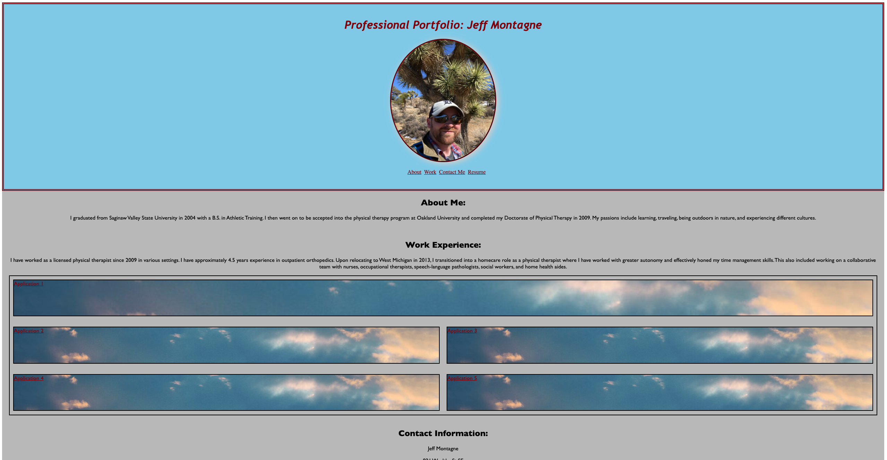

# Assignment 2 - Professional Portfolio

## Description

This application is meant to provide prospective employers the ability to view my work samples and experience. The current version of this application was created using only HTML and CSS languages, per the criteria of the assignment. It was built to be responsive to all viewports. The navigation links will take all viewers to the corresponding sections on the page. The links within the work section will take viewers to the corresponding applications. In this current version placeholders have been placed in lieu of future projects that are to be included throughout the course of the bootcamp. The layout of the page includes the use of flexbox.

Provide a short description explaining the what, why, and how of your project. Use the following questions as a guide:

- What was your motivation?
- Why did you build this project? (Note: the answer is not "Because it was a homework assignment.")
- What problem does it solve?
- What did you learn?

## Installation

N/A

## Usage

Website: https://tagne13.github.io/Challenge-2/

Repository: https://github.com/Tagne13/Challenge-2.git 

To add a screenshot, create an `assets/images` folder in your repository and upload your screenshot to it. Then, using the relative file path, add it to your README using the following syntax:

## Credits

N/A

## License

N/A
